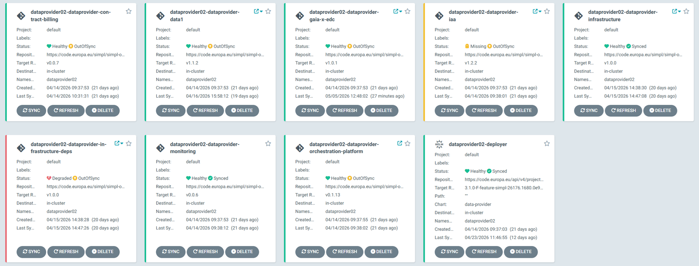
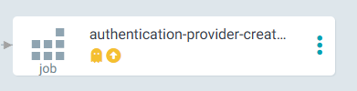
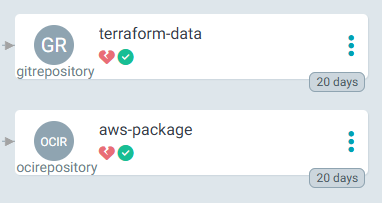
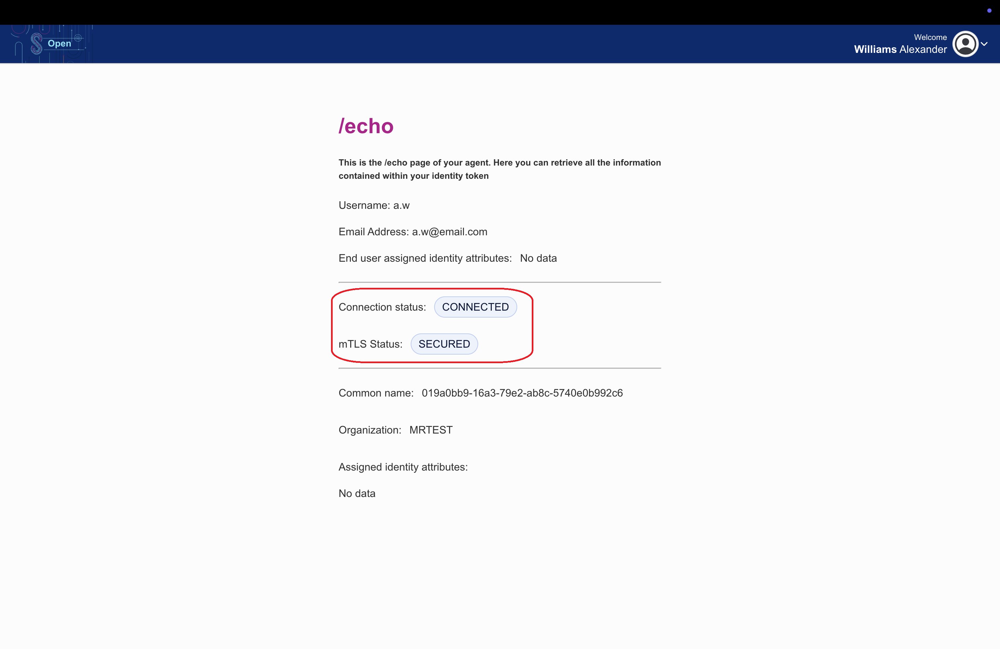

# Data Provider Agent — Deployment Guide

## Document Information

| | |
|---|---|
| **Scope** | Overview, prerequisites, deployment options, post-deployment tasks, and troubleshooting for the SIMPL-Open Middleware Data Provider agent. |
| **Audience** | Platform engineers and DevOps engineers responsible for deploying and operating the Data Provider agent on Kubernetes. |

---

<!-- TOC -->
- [Description](#description)
- [Component Chart Sources](#component-chart-sources)
- [Prerequisites](#prerequisites)
  - [Tools](#tools)
  - [DNS Entries](#dns-entries)
- [Preliminary Tasks](#preliminary-tasks)
  - [OpenBao Related Tasks](#openbao-related-tasks)
- [Deployment](#deployment)
- [Additional Steps and Remarks](#additional-steps-and-remarks)
  - [Secret for Infrastructure-be](#secret-for-infrastructure-be)
  - [Secret for simpl-edc](#secret-for-simpl-edc)
  - [Onboarding](#onboarding)
  - [Tier2-proxy Status](#tier2-proxy-status)
  - [Retrieve Tier2 Gateway Public IP address](#retrieve-tier2-gateway-public-ip-address)
  - [Monitoring](#monitoring)
- [Sanity check](#sanity-check)
  - [ArgoCD statuses](#argocd-statuses)
  - [Echo page](#echo-page)
- [Troubleshooting](#troubleshooting)
- [Glossary](#glossary)
<!-- /TOC -->

## Description

This repository contains the configuration files required for deploying the **Data Provider** agent using Helm charts in a Kubernetes environment.

- The deployment is orchestrated by a master Helm chart that deploys the full Data Provider stack with a single command or ArgoCD Application resource.
- Templates of `values.yaml` files used in the integration environment are provided under the `app-values` folder.

## Component Chart Sources

All sub-charts used by the Data Provider master chart are internal SIMPL-Open charts hosted in the GitLab package registry. Access requires appropriate GitLab credentials.

| Name | Chart | Description | Helm Registry |
|---|---|---|---|
| provider-iaa | `provider-iaa` | Identity, Authentication, and Authorisation services for the Data Provider agent | [Helm stable registry](https://code.europa.eu/api/v4/projects/1403/packages/helm/stable) |
| provider-gaia-x-edc | `provider-gaia-x-edc` | Gaia-X EDC connector for the Data Provider agent | [Helm stable registry](https://code.europa.eu/api/v4/projects/1400/packages/helm/stable) |
| provider-data1 | `provider-data1` | Data services layer for the Data Provider agent | [Helm stable registry](https://code.europa.eu/api/v4/projects/1397/packages/helm/stable) |
| provider-contract-billing | `provider-contract-billing` | Contract and billing management for the Data Provider agent | [Helm stable registry](https://code.europa.eu/api/v4/projects/1405/packages/helm/stable) |
| provider-infrastructure | `provider-infrastructure` | Infrastructure management services for the Data Provider agent | [Helm stable registry](https://code.europa.eu/api/v4/projects/1407/packages/helm/stable) |
| provider-monitoring | `provider-monitoring` | Monitoring configuration for the Data Provider agent | [Helm stable registry](https://code.europa.eu/api/v4/projects/1395/packages/helm/stable) |
| provider-orchestration-platform | `provider-orchestration-platform` | Orchestration platform services for the Data Provider agent | [Helm stable registry](https://code.europa.eu/api/v4/projects/1410/packages/helm/stable) |

## Prerequisites

### Tools

The requirements tools are listed here: [Tools requirements](https://code.europa.eu/simpl/simpl-open/cross-cutting/documentation/installation-guide/-/blob/main/Prerequisites.md?ref_type=heads#tools-requirements)

| Pre-Requisite | Version  | Type | Description | External link |
|---|:---:|---|---|---|
| S3 type storage of your choice | --- | Mandatory | Any type of S3 storage that you might already have. If not, you can deploy, for example, Minio or Garage S3. | [Minio documentation](https://docs.min.io/)<br>[Garage S3 documentation](https://garagehq.deuxfleurs.fr/documentation/) |

### DNS Entries

| Component | FQDN Pattern | Public IP |
|---|---|---|
| catalogue-ui | `catalogue-ui.{namespaceTag}.{domainSuffix}` | Default Ingress Controller Public IP |
| gitea-http | `gitea.crossplane.{namespaceTag}.{domainSuffix}` | Default Ingress Controller Public IP |
| infrastructure-argo-cd-server | `argoui.crossplane.{namespaceTag}.{domainSuffix}` | Default Ingress Controller Public IP |
| infrastructure-argo-workflows-server | `argoworkflows.crossplane.{namespaceTag}.{domainSuffix}` | Default Ingress Controller Public IP |
| infrastructure-be | `infrastructure-be.{namespaceTag}.{domainSuffix}` | Default Ingress Controller Public IP |
| infrastructure-fe-frontend | `infrastructure-fe.{namespaceTag}.{domainSuffix}` | Default Ingress Controller Public IP |
| sd-ui | `sd-ui.{namespaceTag}.{domainSuffix}` | Default Ingress Controller Public IP |
| simpl-fe-authentication-provider | `participant.fe.{namespaceTag}.{domainSuffix}/participant-utility` | Default Ingress Controller Public IP |
| simpl-fe-users-roles | `participant.fe.{namespaceTag}.{domainSuffix}/users-roles` | Default Ingress Controller Public IP |
| simpl-files | `files.{namespaceTag}.{domainSuffix}` | Default Ingress Controller Public IP |
| simpl-ingress | `participant.be.{namespaceTag}.{domainSuffix}` | Default Ingress Controller Public IP |
| tier2-gateway | `tls.participant.{namespaceTag}.{domainSuffix}` | Dedicated Load Balancer IP |

If your Ingress Controller is **nginx** and installed into namespace **ingress-nginx**, you can retrieve its public IP using:

```bash
kubectl get svc ingress-nginx-controller -n ingress-nginx -o jsonpath='{.status.loadBalancer.ingress[0].ip}'
```

The Tier2 Gateway's Load Balancer public IP can be extracted only after the succesful deployment - instructions [below](#retrieve-tier2-gateway-public-ip-address)

While we recommend strongly to use **external-dns** to manage your DNS entries using automation, one could achieve a manual DNS setup.

Here is a proposed implementation of manual DNS configuration:

- Create an `A` record using `{namespaceTag}.{domainSuffix}` pointing to the public IP of the Ingress Controller
- For each entry but the *tier2-gateway* in the above table, create a `CNAME` record using value of *FQDN Pattern* column pointing to `{namespaceTag}.{domainSuffix}`
- For *tier2-gateway* create an `A` record using `tls.participant.{namespaceTag}.{domainSuffix}` pointing to the public IP of the *tier2-gateway* kubernetes service within the namespace where the application is deployed (ie, `{namespaceTag}`)

## Preliminary Tasks

These tasks must be completed **before** proceeding with either deployment method.

### OpenBao Related Tasks

Access OpenBao at: `https://secrets.{common-namespaceTag}.{domainSuffix}`

The root token can be found in the Common namespace, in the secret `secrets-root-token`, under the key `token`.

The description of using OpenBao is in a separate document:
<https://code.europa.eu/simpl/simpl-open/development/agents/common_components/-/blob/main/documents/user-manual/Using_OpenBao.md>

Please read the document above before proceeding with the next steps related to accessing and modifying OpenBao contents.

## Deployment

The Data Provider agent can be deployed using either of the following methods. Choose the guide that matches your workflow:

| Method | Guide | Description |
|---|---|---|
| **ArgoCD UI** | [ARGOCD_DEPLOYMENT.md](ARGOCD_DEPLOYMENT.md) | Deploy through the ArgoCD graphical interface by creating an Application resource. Recommended for teams using GitOps workflows. |
| **Helm CLI** | [HELM_CLI_DEPLOYMENT.md](HELM_CLI_DEPLOYMENT.md) | Deploy from the command line using `helm install`. Suitable for scripted or CI/CD-driven deployments. |

## Additional Steps and Remarks

### Secret for Infrastructure-be

Edit the OpenBao key named `{dataprovider-namespace}-infrastructure-be` (where the first part reflects your Data Provider namespace).

You can only request the Gitea token after the provider is deployed. After changing the values in the secret, restart the `infrastructure-be` pod.

To obtain the value for `gitea.token`, execute the following command (replace the values in brackets with variables from your deployment):

```bash
curl -X POST "https://gitea.crossplane.{namespaceTag}.{domainSuffix}/api/v1/users/{gitea.username}/tokens" \
  -u {gitea.username}:{gitea.password} \
  -H "Content-Type: application/json" \
  -d '{
    "name": "token-name",
    "scopes": ["all"]
  }'
```

The response will contain a `sha1` field:

```bash
{"id":3,"name":"token-name","sha1":"<gitea-token>","token_last_eight":"example","scopes":null}
```

Place the value of the `sha1` key into the following secret variable:

| Variable Name | Example | Description |
|---|:---:|---|
| `gitea.token` | `<gitea-token>` | Token to access Gitea |

### Secret for simpl-edc

Edit the OpenBao key named `{dataprovider-namespace}-simpl-edc` (where the first part reflects your Data Provider namespace). You need to provide the endpoint and keys for your S3 storage.

The following variables must be modified:

| Variable Name | Example | Description |
|---|:---:|---|
| `fr_gxfs_s3_access_key` | `minioacckey` | Access key for the S3 storage user |
| `fr_gxfs_s3_endpoint` | `https://minio.address.eu` | S3 API address |
| `fr_gxfs_s3_secret_key` | `minioseckey` | Secret key for the S3 storage user |

All other necessary secrets are created automatically with the correct data.

### Onboarding

After the deployment process is complete, a manual onboarding process for the participant is required.

The steps are described in the IAA documentation:
<https://code.europa.eu/simpl/simpl-open/development/iaa/agent-iaa/authority-iaa/-/blob/v1.2.14/documents/user-manual/ONBOARD.md>

### Tier2-proxy Status

Until the agent is properly onboarded, the tier2-proxy component will **not** operate correctly. This is expected behaviour; proceed with the onboarding steps above before investigating tier2-proxy health.

### Retrieve Tier2 Gateway Public IP address

If the Authority agent is deployed within namespace **{namespaceTag}**, you can retrieve the *tier2-gateway* public IP using:

```bash
kubectl get svc tier2-gateway -n {namespaceTag} -o jsonpath='{.status.loadBalancer.ingress[0].ip}'
```

### Monitoring

Filebeat components for log monitoring are included in this release. Their deployment can be disabled by setting `monitoring.enabled` to `false` in the Helm values.

## Sanity check

### ArgoCD statuses

To make sure that everything is running correctly, you can check the statuses of apps in ArgoCD.<br><br>


Normally, every app should have a healthy status, but at the moment there are exceptions:
- dataprovider-iaa application can get a "Missing" status, because of authentication-provider-create-secret job which is removed after it's been processed. 

<br><br>

- dataprovider-infrastructure-deps application can get a "Degraded" status, because of statuses of resources listed below, it's an expected behaviour.


This will be fixed in future releases.

### Echo page

The echo page helps you understand whether you can communicate with the authority in tier 2, allowing participants to obtain information about the connection and security and receive information about the organization they belong to (identifying who you are).
You can access the page via the link. `<participant-frontend>/participant-utility/echo`.

(i.e., a user with the **ONBOARDER_M** role, such as the preconfigured user `a.w`)

The fields marked in red frame, should be exactly as on the screenshot:


## Troubleshooting

If you encounter issues during deployment, verify the following:

- ArgoCD is properly set up and running.
- The target namespace exists in your Kubernetes cluster.
- Review the ArgoCD Application logs and Helm error messages for specific issues.
- All [DNS entries](#dns-entries) resolve correctly to the ingress controller.
- The [Preliminary Tasks](#preliminary-tasks) (OpenBao secrets, Minio, Gitea token) have been completed.

## Glossary

| Term | Definition |
|---|---|
| **ArgoCD** | A GitOps continuous delivery tool for Kubernetes that synchronises application state from a Git repository or Helm registry. |
| **Helm** | The package manager for Kubernetes, using charts to define, install, and upgrade applications. |
| **Master Helm Chart** | A top-level chart that orchestrates the deployment of multiple sub-charts as a single unit. |
| **namespaceTag** | An identifier used in Kubernetes namespace names and DNS entries to distinguish deployments. |
| **domainSuffix** | The base domain name appended to generated DNS entries (e.g. `example.com`). |
| **FQDN** | Fully Qualified Domain Name — the complete DNS name for a service. |
| **OpenBao** | An open-source secrets management tool (fork of HashiCorp Vault) used to store and access sensitive configuration. |
| **KV Secret Engine** | A key-value secret storage backend in OpenBao / Vault. |
| **cert-manager** | A Kubernetes add-on that automates the management and issuance of TLS certificates. |
| **nginx-ingress** | An ingress controller that manages external access to services in a Kubernetes cluster. |
| **tier2-proxy** | A gateway component in the SIMPL-Open architecture that handles inter-agent communication. |
| **Data Provider** | A SIMPL-Open agent representing a data space participant that provides data and services. |
| **EDC** | Eclipse Dataspace Connector — the component that handles data exchange between participants. |
| **S3** | An S3-compatible object storage solution used for EDC data transfers. |
| **Crossplane** | A Kubernetes add-on for provisioning and managing cloud infrastructure resources declaratively. |
| **Gitea** | A self-hosted Git service used by the Data Provider's infrastructure components. |
