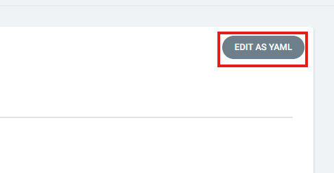
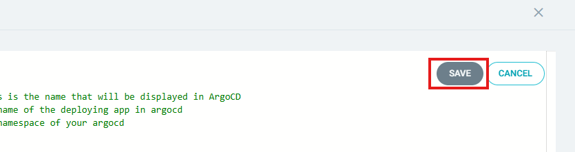
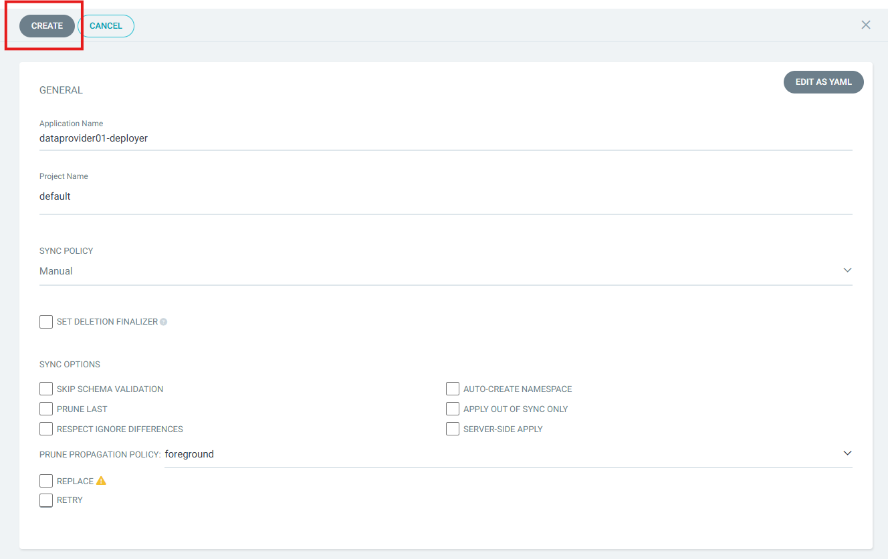
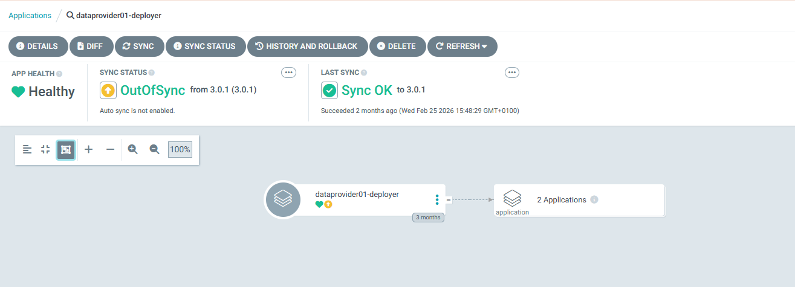

# Data Provider — ArgoCD UI Deployment

## Document Information

| | |
|---|---|
| **Scope** | Step-by-step instructions for deploying the SIMPL-Open Middleware Data Provider agent through the ArgoCD graphical interface. |
| **Audience** | Platform engineers and DevOps engineers with access to the ArgoCD UI and permissions to create Application resources. |

---

> For command-line deployment using Helm and kubectl, see [HELM_CLI_DEPLOYMENT.md](HELM_CLI_DEPLOYMENT.md).

## Prerequisites

Before proceeding, ensure the following requirements are met:

- **ArgoCD 3.2.x or newer** is installed and accessible.
- You have sufficient permissions to create ArgoCD Application resources in the target project.
- The **Common Components** have been deployed and are healthy.
- The **Governance Authority** agent has been deployed and is operational.
- All [preliminary tasks](README.md#preliminary-tasks) (OpenBao secrets, Minio configuration) have been completed.
- The required DNS entries listed in the [main deployment guide](README.md#dns-entries) have been provisioned.

## Deployment Procedure

Follow the steps below to deploy the Data Provider agent through the ArgoCD UI.

### Step 1 — Log in to ArgoCD

Open the ArgoCD web interface in your browser and authenticate with your credentials. You must have permissions to create Application resources in the target project.


### Step 2 — Create a new Application

From the ArgoCD dashboard, click the **+ NEW APP** button in the top-left area of the interface.


### Step 3 — Switch to the YAML editor

In the new application creation form, click the **EDIT AS YAML** button (located in the upper-right area of the form). This opens the raw YAML editor where you can paste the full Application manifest.



### Step 4 — Paste the Application manifest

Copy the YAML manifest from the [Example ArgoCD Application Manifest](#example-argocd-application-manifest) section below (after replacing all placeholder values), paste it into the YAML editor, and click **SAVE**.



### Step 5 — Verify the populated fields

After saving, ArgoCD switches back to the form view. Verify that the following fields have been correctly populated from the manifest:

| Field in ArgoCD UI | Expected value | Corresponds to manifest field |
|---|---|---|
| **Application Name** | `<dataprovider-namespace>-deployer` | `metadata.name` |
| **Project Name** | `default` (or your chosen project) | `spec.project` |
| **Repository URL** | `https://code.europa.eu/api/v4/projects/904/packages/helm/stable` | `spec.source.repoURL` |
| **Chart** | `data-provider` | `spec.source.chart` |
| **Target Revision** | `3.1.6` (your chart version) | `spec.source.targetRevision` |
| **Cluster URL** | `https://kubernetes.default.svc` | `spec.destination.server` |
| **Namespace** | Your data provider agent namespace | `spec.destination.namespace` |

If any field is empty or incorrect, click **EDIT AS YAML** again, correct the manifest, and save.



### Step 6 — Create and synchronise

Click the **CREATE** button to create the Application. ArgoCD will begin synchronising the resources to your cluster. You can monitor progress in the Application detail view.



> **Note:** Depending on cluster resources and network conditions, full synchronisation may take up to 30 minutes.

---

## Configuration Reference

The sections below provide the full list of values that must be replaced, followed by the complete example manifest to copy into the YAML editor.

> **WARNING — All values below are example placeholders.**
> They **MUST** be replaced with values specific to your environment before deploying. Deploying with the example values as-is will fail or produce an incorrect configuration.

### Values That Must Be Replaced

| Value in example | Field(s) | What to set |
|---|---|---|
| `<dataprovider-namespace>` | `namespaceTag.dataprovider`, `argocd.appname`, `cluster.namespace`, `destination.namespace`, `metadata.name` | Your chosen namespace identifier for this data provider agent |
| `<authority-namespace>` | `namespaceTag.authority` | The namespace identifier of your Governance Authority deployment |
| `<common-namespace>` | `namespaceTag.common`, `cluster.commonToolsNamespace` | The namespace identifier of your Common Components deployment |
| `<your-domain>` | `domainSuffix` | Your actual domain name |
| `default` | `project` | The ArgoCD project to which this deployment belongs |
| `3.1.6` / `v3.1.6` | `targetRevision`, `values.branch` | The Helm chart version and corresponding Git branch for your release |
| `example` | `secrets.secretEngine` | The name of the KV secret engine configured in your OpenBao |
| `example-role` | `secrets.role` | The name of the role configured in your OpenBao |
| `<your-issuer>` | `cluster.issuer` | Your certificate issuer name |
| `pass` | `crossplane.kafka.password` | Your Kafka password (username format: `{namespace}_infrabe`; password from `{common-namespace}-kafka-credentials` OpenBao secret) |
| `pass` | `crossplane.gitea.password` | Your Gitea password (password can be any value of your choice), username is hardcoded to **gitops_test** |

**Fields that typically do not need changing:** `repoURL` (unless you host your own mirror), `cluster.address` (unless deploying to a remote cluster).

### Example ArgoCD Application Manifest

```yaml
apiVersion: argoproj.io/v1alpha1
kind: Application
metadata:
  name: '<dataprovider-namespace>-deployer'            # name of the deploying app in argocd
spec:
  project: default                                     # project in which the deployer app is created
  source:
    repoURL: 'https://code.europa.eu/api/v4/projects/904/packages/helm/stable'
    path: '""'
    targetRevision: 3.1.6                              # version of package
    helm:
      values: |
        values:
          branch: v3.1.6                               # branch of repo with values - for released version it should be the release branch
        project: default                               # project to which the namespace is attached
        namespaceTag:
          dataprovider: <dataprovider-namespace>       # identifier of deployment and part of fqdn for this agent
          authority: <authority-namespace>             # identifier of deployment and part of fqdn for authority
          common: <common-namespace>                   # identifier of deployment and part of fqdn for common components
        domainSuffix: <your-domain>                    # last part of fqdn
        resourcePreset: default                        # set to "low" to disable requests of resources
        argocd:
          appname: <dataprovider-namespace>            # name of generated argocd app
          namespace: argocd                            # namespace of your argocd
        cluster:
          address: https://kubernetes.default.svc
          namespace: <dataprovider-namespace>          # where the app will be deployed
          commonToolsNamespace: <common-namespace>     # namespace where main monitoring stack is deployed
          issuer: <your-issuer>                        # issuer of certificates
        secrets:
          role: <role_name>                            # role created in OpenBao for access
          secretEngine: <secret_engine_name>           # secret engine name created in OpenBao
        crossplane:
          kafka:
            password: pass                             # password of user {namespace}_infrabe from {common-namespace}-kafka-credentials OpenBao secret
          gitea:
            password: pass                             # password for Gitea (set to your preference)
        dataprovider_infrastructure:                   
          enabled: false                               # set to true to deploy infrastructure components - that stack can be deployed only once per cluster
        dataprovider_monitoring:
          enabled: true                                # set to false to disable monitoring
        dataprovider_iaa:
          extraValues:
            eidas:
              enabled: true                            # enable eIDAS configuration in Keycloak, you can set it to false if not needed
    chart: data-provider
  destination:
    server: 'https://kubernetes.default.svc'
    namespace: <dataprovider-namespace>                # where the package will be deployed
```

> As there are also other "enabled" switches in values - they are only for development purposes. Monitoring is the only stack that can be disabled without causing harm to the environment, that's the reason it's the only one that's listed above.
> On the other end, dataprovider_infrastructure can be deployed only once per cluster, so if you have more dataproviders than one, be sure to have it enabled in only one of them. 

Also, additionally to what is described in the snippet above, all of the following apps deployment can be disabled, but it will affect out-of-the-box functionality. 
To do so, add the following keys to with value "false" in spec.source.helm.values:

| Field | Description |
|---|---|
| `dataprovider_iaa.extraValues.keycloak.enabled` | Disable Keycloak |
| `dataprovider_iaa.extraValues.tier1_gateway.enabled` | Disable Tier1 Gateway |
| `dataprovider_iaa.extraValues.tier2_gateway.enabled` | Disable Tier2 Gateway |
| `dataprovider_iaa.extraValues.tier2_proxy.enabled` | Disable Tier1 Proxy |
| `dataprovider_iaa.extraValues.redis.enabled` | Disable Redis |
| `dataprovider_iaa.extraValues.users_roles.enabled` | Disable Users Roles |
| `dataprovider_iaa.extraValues.users_roles_fe.enabled` | Disable Users Roles frontend |
| `dataprovider_iaa.extraValues.auth_provider.enabled` | Disable Authentication Provider |
| `dataprovider_iaa.extraValues.authentication_provider_fe.enabled` | Disable Authentication Provider frontend |
| `dataprovider_gaia_x_edc.extraValues.signer.enabled` | Disable Signer |
| `dataprovider_gaia_x_edc.extraValues.simpl_edc.enabled` | Disable EDC |
| `dataprovider_gaia_x_edc.extraValues.simpl_catalogue_client.enabled` | Disable Catalogue Client |
| `dataprovider_gaia_x_edc.extraValues.sd_ui.enabled` | Disable SD UI |
| `dataprovider_data1.extraValues.edc_connector_adapter.enabled` | Disable EDC Connector Adapter |
| `dataprovider_data1.extraValues.files.enabled` | Disable Files app |
| `dataprovider_data1.extraValues.schema_sync_adapter.enabled` | Disable Schema Sync Adapter |
| `dataprovider_data1.extraValues.sdtooling_api_be.enabled` | Disable SDTooling API |
| `dataprovider_data1.extraValues.sdtooling_validation_api_be.enabled` | Disable SDTooling Validation API |
| `dataprovider_data1.extraValues.xfsc_advsearch_be.enabled` | Disable Advsearch |
| `dataprovider_contract_billing.extraValues.contract.enabled` | Disable Contract |
| `dataprovider_contract_billing.extraValues.stubs.enabled` | Disable Stubs |
| `dataprovider_contract_billing.extraValues.signingService.enabled` | Disable Signing Service |
| `dataprovider_orchestration_platform.extraValues.dagster.enabled` | Disable Dagster |
| `dataprovider_orchestration_platform.extraValues.assetorchestrator.enabled` | Disable Asset Orchestrator |
| `dataprovider_infrastructure.extraValues.crossplane.enabled` | Disable Crossplane |
| `dataprovider_infrastructure.extraValues.infrastructure_be.enabled` | Disable Infrastructure Backend |
| `dataprovider_infrastructure.extraValues.infrastructure_fe.enabled` | Disable Infrastructure Frontend |
| `dataprovider_infrastructure.extraValues.gitea.enabled` | Disable Gitea |
| `dataprovider_infrastructure.extraValues.argocd.enabled` | Disable Infra's ArgoCD |
| `dataprovider_infrastructure.extraValues.argoevents.enabled` | Disable Argo Events |
| `dataprovider_infrastructure.extraValues.argoworkflows.enabled` | Disable Argo Workflows |
| `dataprovider_infrastructure.extraValues.fluxcd.enabled` | Disable FluxCD |
| `dataprovider_infrastructure.extraValues.provisionerresources.enabled` | Disable Provisioner |
| `dataprovider_infrastructure.extraValues.tfcontroller.enabled` | Disable Tofu Controller |
| `dataprovider_infrastructure.extraValues.eso.enabled` | Disable External Secrets |

## Verification

After creating the Application in ArgoCD, verify the deployment:

1. Open the ArgoCD UI and navigate to the newly created Application (e.g. `<dataprovider-namespace>-deployer`).
2. Confirm that the sync status is **Synced** and the health status is **Healthy**.
3. If the Application is in a **Degraded** or **OutOfSync** state, inspect the individual resource details and event logs within ArgoCD for error messages.
4. Verify that all expected pods are running in the target namespace:
   ```bash
   kubectl get pods -n <dataprovider-namespace>
   ```
5. Verify that the expected ingress resources have been created:
   ```bash
   kubectl get ingress -n <dataprovider-namespace>
   ```
6. Proceed with the [Onboarding](README.md#onboarding) steps described in the main deployment guide.

> **Note:** The tier2-gateway and tier2-proxy components will not become healthy until the post-deployment onboarding is complete.

## See Also

- [Main Deployment Guide (README)](README.md) — prerequisites, preliminary tasks, troubleshooting, and onboarding procedures.
- [Helm CLI Deployment Guide](HELM_CLI_DEPLOYMENT.md) — alternative deployment method using the command line.
